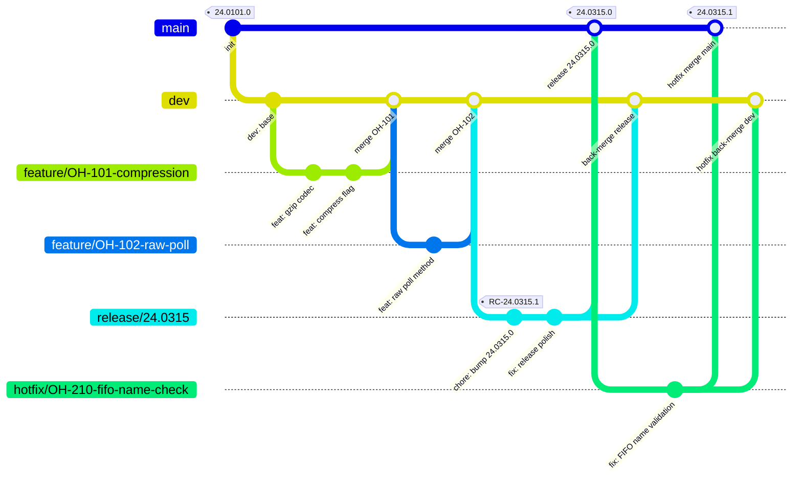

# Branching Strategy

This document describes the Git branching model, versioning scheme, and merge conventions for `pubsublib-python`.

---

## Branch Overview

| Branch | Purpose | Merges Into | Source Branch |
|---|---|---|---|
| `main` | Production-ready code; PyPI releases cut from here | — | hotfix only |
| `dev` | Integration branch; all features merge here first | `main` (via release) | — |
| `release/*` | Release stabilisation | `main` + `dev` | `dev` |
| `feature/<JIRAID>-<name>` | Individual features or improvements | `dev` | `dev` |
| `hotfix/<JIRAID>-<desc>` | Critical production fixes | `main` + `dev` + `release/*` | `main` |

---

## Gitflow Diagram



---

## Branch Naming Conventions

### Feature Branches
```
feature/<JIRAID>-<short-description>
```
- Always branch from `dev`
- Merge back into `dev` via pull request
- Delete after merge

**Examples:**
```
feature/OH-101-compression-support
feature/OH-155-filter-policy
feature/OH-200-redis-ttl-config
```

### Hotfix Branches
```
hotfix/<JIRAID>-<short-description>
```
- Always branch from `main`
- Merge into: `main`, `dev`, and the active `release/*` branch (if one exists)
- Triggers a patch version increment

**Examples:**
```
hotfix/OH-210-fifo-name-check
hotfix/OH-222-redis-connection-leak
```

### Release Branches
```
release/<YY.MMDD>
```
- Branched from `dev` when a release is being prepared
- Only bug fixes and release chores committed here
- Merged into `main` (tagged) and back-merged into `dev`

---

## Versioning Scheme

### Production Release
```
YY.MMDD.PATCHCOUNT
```

| Segment | Description | Example |
|---|---|---|
| `YY` | 2-digit year | `24` |
| `MMDD` | Zero-padded month and day | `0315` |
| `PATCHCOUNT` | Sequential patch increment for the day; starts at `0` | `0`, `1`, `2` |

Examples: `24.0315.0`, `24.0315.1`, `26.0401.0`

### Release Candidate
```
RC-YY.MMDD.BUILDCOUNT
```
Tagged on the `release/*` branch during stabilisation.

Examples: `RC-24.0315.1`, `RC-26.0401.2`

### Staging / Exploratory Tags
```
stag-<description>
```
Used for internal staging deployments, not published to PyPI.

Examples: `stag-compression-test`, `stag-fifo-validation`

---

## PyPI Publishing

Releases are published to PyPI automatically by the GitHub Actions workflow (`.github/workflows/python-publish.yml`) when a tag matching `v*` is pushed to `main`:

```
git tag v24.0315.0
git push origin v24.0315.0
```

The workflow:
1. Checks out the tagged commit
2. Builds the package with `python -m build`
3. Publishes via `pypa/gh-action-pypi-publish` using the `PYPI_API_TOKEN` secret

---

## Pull Request Rules

- All PRs target either `dev` (features) or `main` (hotfixes)
- At least one CODEOWNER approval is required (see `.github/CODEOWNERS`)
- PRs must follow the `.github/PULL_REQUEST_TEMPLATE.md` format
- Direct pushes to `main` are not permitted except for hotfix merges by CODEOWNERS
