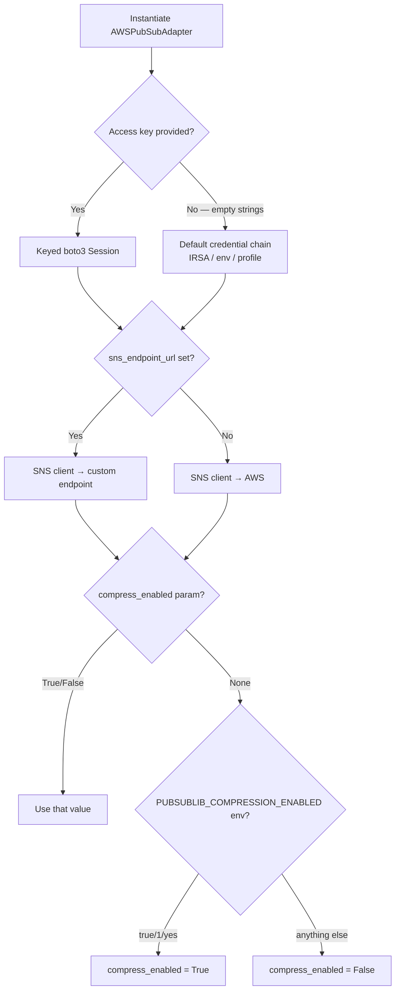

# Configuration

`pubsublib` is configured entirely via constructor parameters and one environment variable. There is no config file; the library is intended to be embedded inside a consumer service which is responsible for loading secrets from its own config management (e.g. Kubernetes Secrets, AWS Secrets Manager, or environment variables).

---

## Constructor Parameters

All configuration is passed when instantiating `AWSPubSubAdapter`:

```python
from pubsublib.aws.main import AWSPubSubAdapter

adapter = AWSPubSubAdapter(
    aws_region="ap-south-1",
    aws_access_key_id="AKIA...",
    aws_secret_access_key="...",
    redis_location="redis://redis-host:6379/0",
    sns_endpoint_url=None,       # optional
    sqs_endpoint_url=None,       # optional
    max_connections=10,          # optional
    compress_enabled=None,       # optional; reads env var if None
)
```

### Parameter Reference

| Parameter | Type | Required | Default | Description |
|---|---|---|---|---|
| `aws_region` | `str` | Yes | — | AWS region (e.g. `ap-south-1`, `us-east-1`) |
| `aws_access_key_id` | `str` | Yes | — | IAM access key. Pass `""` to use the default credential chain (IRSA, env vars, instance profile) |
| `aws_secret_access_key` | `str` | Yes | — | IAM secret key. Pass `""` alongside empty `access_key_id` for IRSA |
| `redis_location` | `str` | Yes | — | Redis URL, e.g. `redis://host:6379/db` or `rediss://host:6380/db` for TLS |
| `sns_endpoint_url` | `str` | No | `None` | Custom SNS endpoint. Set to LocalStack URL for local development |
| `sqs_endpoint_url` | `str` | No | `None` | Custom SQS endpoint. Set to LocalStack URL for local development |
| `max_connections` | `int` | No | `10` | Redis connection pool maximum size |
| `compress_enabled` | `bool \| None` | No | `None` | Enable gzip+base64 compression on published payloads. `None` defers to `PUBSUBLIB_COMPRESSION_ENABLED` env var |

---

## Environment Variables

| Variable | Values | Default | Description |
|---|---|---|---|
| `PUBSUBLIB_COMPRESSION_ENABLED` | `true`, `1`, `yes` (case-insensitive) | disabled | Enables payload compression when `compress_enabled=None` is passed to the constructor |

Compression can also be toggled at runtime:

```python
adapter.set_compression_enabled(True)
```

---

## AWS Credential Strategies

### Explicit Keys (Development / CI)
Pass `aws_access_key_id` and `aws_secret_access_key` directly. These should be loaded from a secrets manager, never hard-coded.

```python
adapter = AWSPubSubAdapter(
    aws_region=os.environ["AWS_REGION"],
    aws_access_key_id=os.environ["AWS_ACCESS_KEY_ID"],
    aws_secret_access_key=os.environ["AWS_SECRET_ACCESS_KEY"],
    redis_location=os.environ["REDIS_URL"],
)
```

### IAM Roles for Service Accounts — IRSA (Kubernetes / EKS)
Pass empty strings for both key parameters. The boto3 default credential provider chain resolves the role automatically via the projected service account token.

```python
adapter = AWSPubSubAdapter(
    aws_region=os.environ["AWS_REGION"],
    aws_access_key_id="",
    aws_secret_access_key="",
    redis_location=os.environ["REDIS_URL"],
)
```

> **Note:** `aws_region` must still be provided explicitly (or `AWS_REGION` / `AWS_DEFAULT_REGION` must be set in the environment) when using IRSA.

---

## Queue and Topic Defaults

These defaults are applied when creating resources and can be overridden at call time:

| Resource | Attribute | Default |
|---|---|---|
| SQS Queue | `VisibilityTimeout` | 30 seconds |
| SQS Queue | `MessageRetentionPeriod` | 345 600 s (4 days) |
| Redis large-message TTL | — | 14 400 minutes (10 days) |
| SQS poll | `WaitTimeSeconds` | 20 seconds (long-polling) |
| SQS poll | `MaxNumberOfMessages` | 10 |
| SQS poll | `VisibilityTimeout` | 15 seconds |

---

## Large-Message Threshold

Messages larger than **64 KB** (`64 * 1024` bytes, measured after optional compression) are automatically offloaded to Redis. This threshold is a constant in `src/pubsublib/aws/utils/helper.py` and is not currently configurable via the constructor.

---

## Configuration Decision Tree


