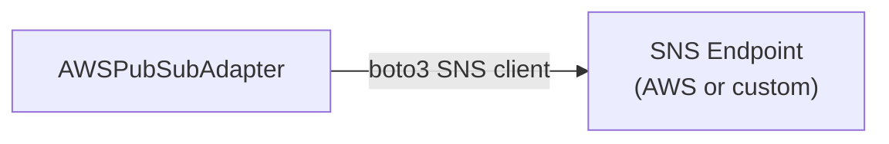
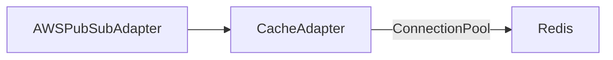
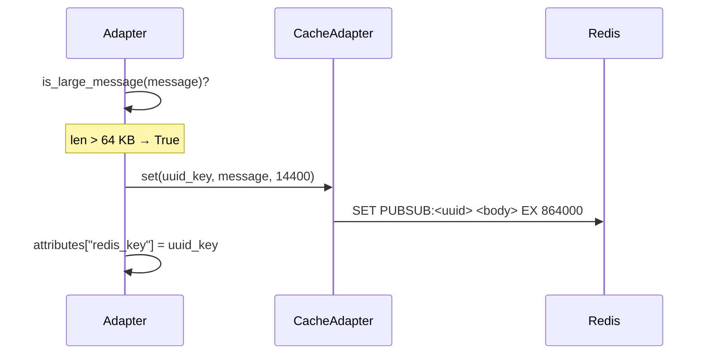
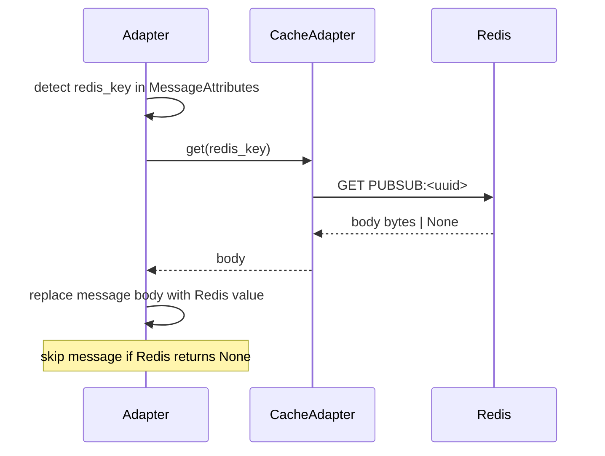
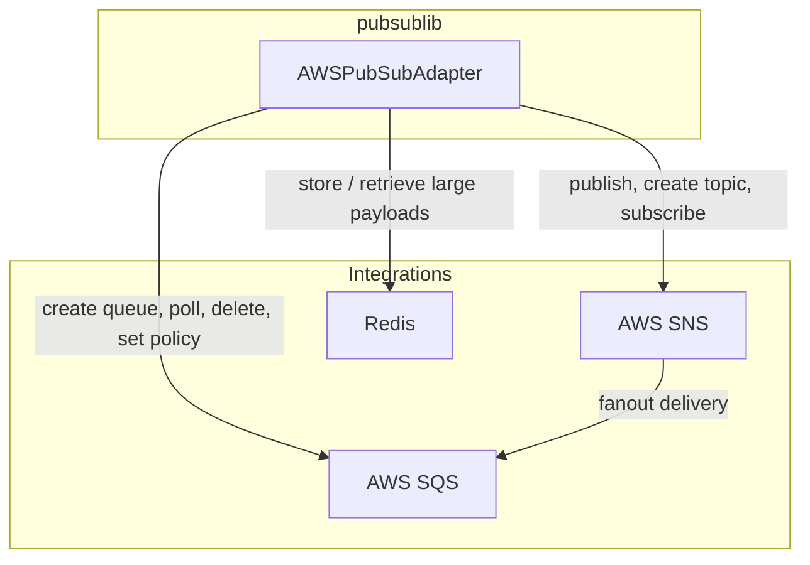

# Integrations

`pubsublib` integrates with three external systems: **AWS SNS**, **AWS SQS**, and **Redis**. This document describes how each integration works, how it is configured, and the data contracts involved.

---

## AWS SNS (Simple Notification Service)

### Role
SNS acts as the **fan-out broker**. Producers publish events to an SNS topic; all subscribing SQS queues receive a copy automatically.

### Connection
A `boto3` SNS client is created inside `AWSPubSubAdapter.__init__`. When `sns_endpoint_url` is provided, the client targets that URL instead of the public AWS endpoint (useful for LocalStack or other local emulators).



### Operations Used

| boto3 Call | Library Method | Notes |
|---|---|---|
| `sns.create_topic` | `create_topic` | Standard and FIFO variants |
| `sns.publish` | `publish_message` | With `MessageAttributes`; FIFO adds `MessageGroupId`, `MessageDeduplicationId` |
| `sns.subscribe` | `subscribe_to_topic` | Subscribes an SQS ARN with optional `FilterPolicy` |
| `sns.tag_resource` | `tag_sns_resource` | Adds resource tags |

### SNS Message Envelope
When raw message delivery is **disabled** (default), SNS wraps the published payload in an envelope that is delivered to SQS:

```json
{
  "Type": "Notification",
  "MessageId": "...",
  "TopicArn": "arn:aws:sns:...",
  "Message": "<original message string>",
  "MessageAttributes": {
    "source":     { "Type": "String", "Value": "..." },
    "contains":   { "Type": "String", "Value": "..." },
    "event_type": { "Type": "String", "Value": "..." },
    "trace_id":   { "Type": "String", "Value": "..." }
  }
}
```

`poll_message_from_queue` parses this envelope. `poll_raw_message_from_queue` is used when raw delivery is enabled and no envelope is present.

---

## AWS SQS (Simple Queue Service)

### Role
SQS acts as the **durable consumer buffer**. Each subscribing service owns one or more SQS queues. SNS pushes messages to those queues; the service polls and processes them at its own pace.

### Connection
A `boto3` SQS client is created inside `AWSPubSubAdapter.__init__` alongside the SNS client. `sqs_endpoint_url` allows the same local-override pattern.

### Operations Used

| boto3 Call | Library Method | Notes |
|---|---|---|
| `sqs.create_queue` | `create_queue` | Standard and FIFO variants; sets `VisibilityTimeout` and `MessageRetentionPeriod` |
| `sqs.set_queue_attributes` | `subscribe_to_topic` (internal) | Writes the IAM resource policy allowing SNS to send |
| `sqs.get_queue_attributes` | `sqs_url_to_arn` | Resolves `QueueArn` from URL |
| `sqs.receive_message` | `poll_*_from_queue` | Long-poll; `WaitTimeSeconds=20` by default |
| `sqs.delete_message` | `poll_*_from_queue` | Called only when handler returns truthy (at-least-once delivery) |
| `sqs.tag_queue` | `tag_sqs_resource` | Adds resource tags |

### Queue Defaults

| Attribute | Default Value |
|---|---|
| `VisibilityTimeout` | 30 seconds |
| `MessageRetentionPeriod` | 345 600 s (4 days) |

### IAM Policy (Auto-applied at Subscribe Time)

```json
{
  "Version": "2012-10-17",
  "Statement": [{
    "Effect": "Allow",
    "Principal": { "Service": "sns.amazonaws.com" },
    "Action": "SQS:SendMessage",
    "Resource": "<sqs-queue-arn>",
    "Condition": {
      "ArnEquals": { "aws:SourceArn": ["<sns-topic-arn>", "..."] }
    }
  }]
}
```

This policy is set each time `subscribe_to_topic` is called and **overwrites** any existing policy on the queue.

---

## Redis

### Role
Redis is used as a **large-payload store** to work around the ~256 KB SNS/SQS payload limit. When a message body exceeds 64 KB (after optional compression), the body is written to Redis; only a UUID key is included in the SNS message attributes. Consumers retrieve the body from Redis before processing.

### Connection
`CacheAdapter` creates a `redis.ConnectionPool` from the `redis_location` URL string, with a configurable pool size (`max_connections`, default 10).



### Key Schema

All keys are prefixed with `PUBSUB:`:

```
PUBSUB:<uuid-v4>   →   <message body string>
```

### TTL
Large messages are stored with a TTL of **14 400 minutes (10 days)**. This allows delayed consumers adequate time to retrieve the payload.

### Publish-time Flow



### Consume-time Flow



---

## Integration Matrix



---

## Local Development with LocalStack

Override both endpoint URLs to point at LocalStack and use dummy credentials:

```python
adapter = AWSPubSubAdapter(
    aws_region="us-east-1",
    aws_access_key_id="test",
    aws_secret_access_key="test",
    redis_location="redis://localhost:6379/0",
    sns_endpoint_url="http://localhost:4566",
    sqs_endpoint_url="http://localhost:4566",
)
```
