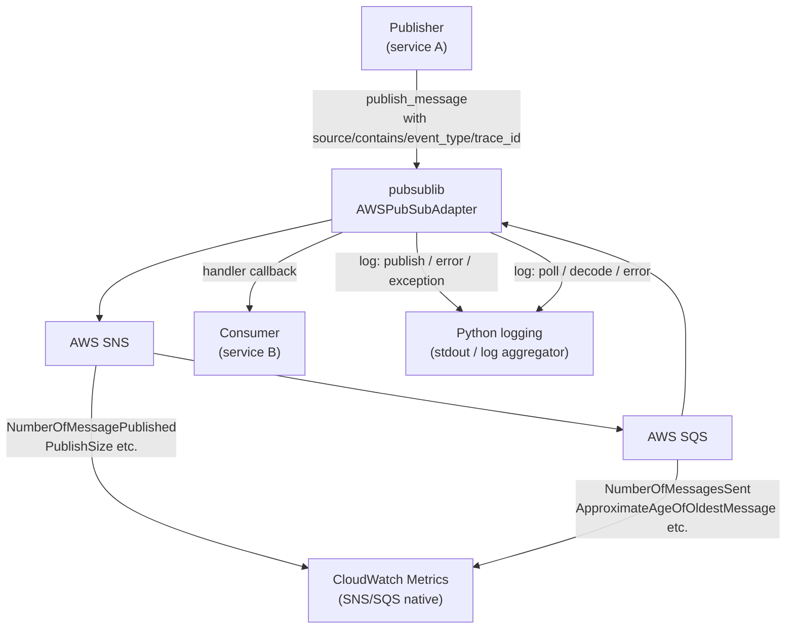

# Observability

`pubsublib` exposes observability through structured **Python logging** and a set of **mandatory message attributes** that every event carries. There is no metrics SDK embedded in the library; instrumentation at the infrastructure level (CloudWatch, Datadog, etc.) is the responsibility of the hosting service.

---

## Logging

All modules use the standard Python `logging` module and retrieve loggers by module name:

```python
import logging
logger = logging.getLogger(__name__)
```

This means each module's log messages are namespaced:

| Logger Name | Module |
|---|---|
| `pubsublib.aws.main` | `AWSPubSubAdapter` |
| `pubsublib.common.codec` | Codec utilities |

Callers control log level and handlers in their own logging configuration; the library never configures handlers itself.

### Log Events

#### `pubsublib.aws.main`

| Level | Event | When |
|---|---|---|
| `INFO` | `Created Standard topic <name>` | After successful standard topic creation |
| `INFO` | `Created FIFO topic with name=<name>` | After successful FIFO topic creation |
| `INFO` | `Created queue <name>` | After successful queue creation |
| `INFO` | `Created FIFO queue with name=<name>` | After successful FIFO queue creation |
| `INFO` | `Subscribed to topic with ARN=<arn>` | After each SNS subscription |
| `INFO` | `No messages in queue with URL=<url>` | When SQS poll returns empty |
| `ERROR` | `FIFO Topic name must end with .fifo!` | Malformed FIFO topic name |
| `ERROR` | `FIFO Queue name must end with .fifo!` | Malformed FIFO queue name |
| `EXCEPTION` | `Couldn't create Standard topic <name>` | `ClientError` on topic creation |
| `EXCEPTION` | `Couldn't publish message to topic <arn>` | `ClientError` on standard publish |
| `EXCEPTION` | `Couldn't publish message to FIFO topic <arn>` | `ClientError` on FIFO publish |
| `EXCEPTION` | `Couldn't poll message from queue with URL=<url>` | `ClientError` on SQS receive |
| `EXCEPTION` | `Couldn't find message body in redis with key=<key>` | Redis miss on large-message retrieval |
| `EXCEPTION` | `Failed to decode/decompress message: <err>` | Decompression error during poll |
| `EXCEPTION` | `Couldn't update SNS policy to push messages to SQS queue <arn>` | IAM policy update failure |
| `EXCEPTION` | `Couldn't tag resource with ARN <arn>` | SNS tag failure |
| `EXCEPTION` | `Couldn't tag queue with URL <url>` | SQS tag failure |

#### `pubsublib.common.codec`

All codec log lines are at `INFO` level and include byte counts and compression ratios:

| Message | Fields |
|---|---|
| `gzip_compress: start` | `input_bytes`, `level` |
| `gzip_compress: done` | `input_bytes`, `output_bytes`, `ratio` (%), `level` |
| `gzip_decompress: start` | `input_bytes` |
| `gzip_decompress: done` | `input_bytes`, `output_bytes` |
| `gzip_and_b64: start` | `input_bytes`, `level` |
| `gzip_and_b64: done` | `input_bytes`, `gz_bytes`, `b64_len`, `level` |
| `b64_decode_and_gunzip_if: start` | `compressed` (bool), `b64_len` |
| `b64_decode_and_gunzip_if: done` | `compressed`, `decoded_bytes` |

---

## Trace ID Propagation

Every message **must** carry a `trace_id` attribute. If the caller does not supply one, `validate_message_attributes` auto-generates a UUID v4:

```python
if "trace_id" not in attributes:
    attributes["trace_id"] = str(uuid.uuid4())
```

This ensures every event can be correlated across services in logs and distributed tracing systems.

---

## Required Message Attributes (Event Envelope)

The following attributes are mandatory on every published event and are validated before the SNS publish call:

| Attribute | Type | Purpose |
|---|---|---|
| `source` | `str` | Originating service name (e.g. `"order-service"`) |
| `contains` | `str` | Data entity type (e.g. `"order"`, `"payment"`) |
| `event_type` | `str` | Event discriminator (e.g. `"created"`, `"updated"`, `"cancelled"`) |
| `trace_id` | `str` | Correlation ID; auto-generated UUID v4 if not provided |

These are propagated by SNS to the SQS message and are available in `MessageAttributes` on the received message.

---

## Observability Flow



---

## Recommended CloudWatch Alarms

These are not configured by the library but are recommended for any service using `pubsublib`:

| Alarm | Metric | Threshold |
|---|---|---|
| DLQ depth | `ApproximateNumberOfMessagesVisible` on DLQ | > 0 |
| Queue age | `ApproximateAgeOfOldestMessage` | > acceptable processing SLA |
| Publish failures | Custom metric from `EXCEPTION` log events | > 0 |
| Redis availability | `CacheAdapter.is_cache_available()` polled externally | `False` |

---

## Structured Logging Recommendation

For production deployments, configure `python-json-logger` or equivalent so that codec log lines (which include byte counts) and exception stack traces are emitted as structured JSON fields rather than raw strings:

```python
import logging
import json_log_formatter

formatter = json_log_formatter.JSONFormatter()
handler = logging.StreamHandler()
handler.setFormatter(formatter)
logging.getLogger("pubsublib").addHandler(handler)
logging.getLogger("pubsublib").setLevel(logging.INFO)
```
