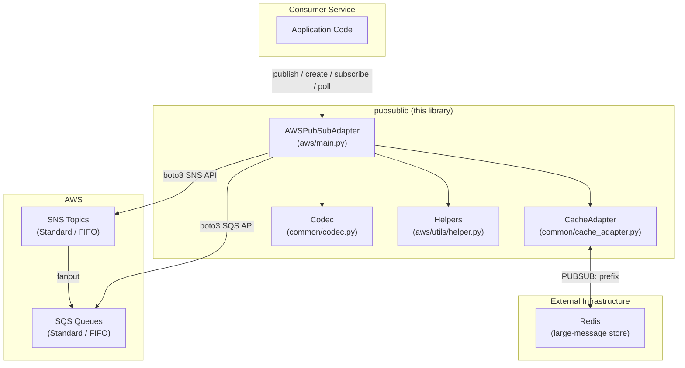
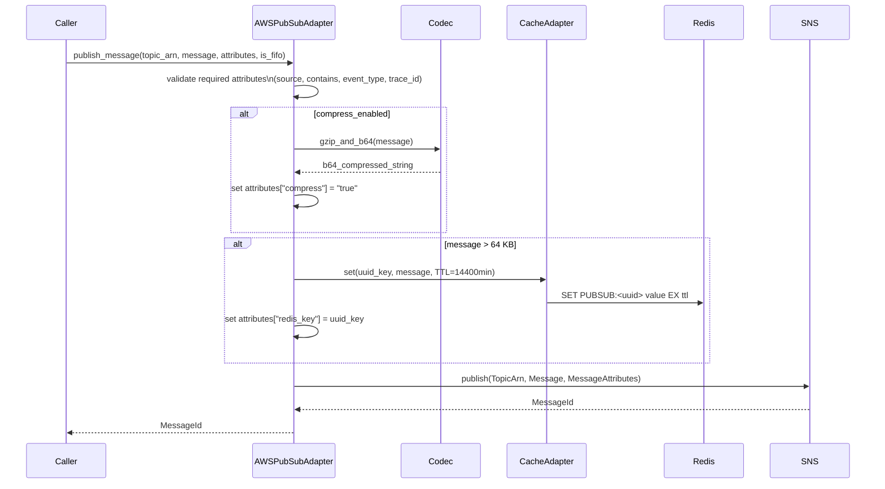
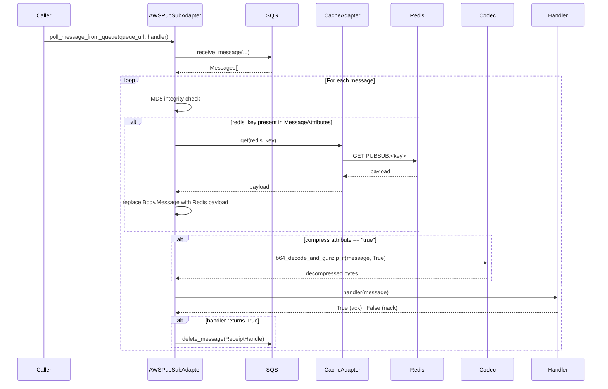

# Architecture Overview

`pubsublib` is a Python library that provides a unified, opinionated abstraction layer over AWS SNS (Simple Notification Service) and AWS SQS (Simple Queue Service) for Orange Health's event-driven microservices architecture.

---

## Purpose

Services within the Orange Health platform communicate asynchronously via events. Rather than each service integrating directly with the AWS SDK, `pubsublib` encapsulates all publish/subscribe concerns:

- Topic and queue lifecycle management
- Message publishing (standard and FIFO)
- Message consumption with handler callbacks
- Transparent payload compression (gzip + base64)
- Large-message offloading via Redis
- Message integrity verification (MD5)
- IAM policy wiring between SNS topics and SQS queues

---

## High-Level Component Diagram

---

## Module Map

| Path | Responsibility |
|---|---|
| `src/pubsublib/aws/main.py` | `AWSPubSubAdapter` — primary public interface |
| `src/pubsublib/aws/utils/helper.py` | Attribute binding, validation, MD5 integrity, large-message detection |
| `src/pubsublib/aws/exceptions.py` | Custom exception types (`InvalidMessageAttributesDefinition`) |
| `src/pubsublib/common/cache_adapter.py` | Redis wrapper (`CacheAdapter`) with `PUBSUB:` key prefix |
| `src/pubsublib/common/codec.py` | gzip compression + base64 encode/decode utilities |

---

## Message Flow: Publishing

---

## Message Flow: Consuming

---

## Key Design Decisions

| Decision | Rationale |
|---|---|
| SNS → SQS fanout pattern | Decouples producers from consumers; multiple services can subscribe to the same topic |
| Redis large-message offload (>64 KB) | AWS SNS/SQS payload limit is 256 KB; Redis offloading keeps message headers small and transport fast |
| gzip + base64 compression | JSON event payloads compress well; base64 ensures the binary output is SNS-safe (text transport) |
| Required attributes: `source`, `contains`, `event_type` | Provides a consistent event envelope for routing, filtering, and observability |
| `trace_id` auto-generation | Ensures every event can be correlated across services even if the caller doesn't supply one |
| FIFO support | Ordered delivery for use cases requiring strict event sequencing |
| Handler-based ack model | Consumer logic is decoupled from the transport; returning `True` deletes the message |

---

## Runtime Dependencies

| Package | Usage |
|---|---|
| `boto3` / `botocore` | AWS SDK — SNS and SQS API calls |
| `redis` | Large-message body offloading and retrieval |

Python ≥ 3.8 is required.
