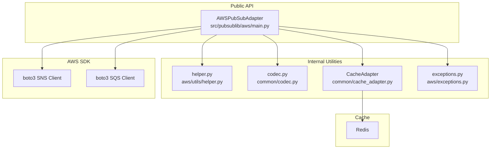

# Service Layer

This document describes the classes, methods, and internal responsibilities of each layer in `pubsublib`.

---

## Layer Diagram



---

## `AWSPubSubAdapter` (`src/pubsublib/aws/main.py`)

The sole public class. Callers instantiate it once (typically at application startup) and call its methods throughout the service lifecycle.

### Constructor Parameters

| Parameter | Type | Required | Default | Description |
|---|---|---|---|---|
| `aws_region` | `str` | Yes | — | AWS region for SNS/SQS clients |
| `aws_access_key_id` | `str` | Yes | — | AWS access key; pass empty string to use IRSA / default credential chain |
| `aws_secret_access_key` | `str` | Yes | — | AWS secret key; pass empty string to use IRSA |
| `redis_location` | `str` | Yes | — | Redis URL (e.g. `redis://localhost:6379/0`) |
| `sns_endpoint_url` | `str` | No | `None` | Override SNS endpoint (useful for LocalStack) |
| `sqs_endpoint_url` | `str` | No | `None` | Override SQS endpoint |
| `max_connections` | `int` | No | `10` | Redis connection pool size |
| `compress_enabled` | `bool` | No | `None` | Enable payload compression. `None` reads `PUBSUBLIB_COMPRESSION_ENABLED` env var |

**Credential resolution order:**
1. Explicit `aws_access_key_id` + `aws_secret_access_key` → creates a keyed `boto3.session.Session`
2. Empty strings → creates a default session (IAM Role / IRSA / env vars / `~/.aws/credentials`)

---

### Public Methods

#### Topic Management

```
create_topic(topic_name, is_fifo, tags={}, content_based_deduplication=False)
```
Dispatches to `__create_topic_standard` or `__create_topic_fifo` based on `is_fifo`.

- FIFO topic names **must** end with `.fifo`; returns `None` if they do not
- Returns the raw boto3 `create_topic` response dict

---

#### Publishing

```
publish_message(topic_arn, message, attributes, is_fifo,
                message_group_id=None, message_deduplication_id=None)
```
Dispatches to the appropriate internal publisher.

Pre-publish pipeline (applied inside both standard and FIFO publishers):

1. **Compression** — if `compress_enabled`, gzip+base64 the message body and set `attributes["compress"] = "true"`
2. **Large-message offload** — if `len(message) > 64 * 1024` bytes, store in Redis with a UUID key and set `attributes["redis_key"] = uuid`; TTL is 14 400 minutes (10 days)
3. **Attribute validation** — `validate_message_attributes` enforces required keys
4. **Attribute binding** — `bind_attributes` converts Python values to the SNS `MessageAttribute` format

Returns `MessageId` on success, `None` on `ClientError`.

---

#### Queue Management

```
create_queue(name, is_fifo, visiblity_timeout=30,
             message_retention_period=345600,
             content_based_deduplication=False, tags={})
```
Default `message_retention_period` is 345 600 s (4 days). FIFO queue names must end with `.fifo`.

---

#### Subscribing

```
subscribe_to_topic(sns_topic_arn_list, sqs_queue_url,
                   raw_message_delivery=False,
                   protocol="sqs", filter_policy={})
```
1. Resolves the SQS ARN from the queue URL
2. Updates the SQS queue's IAM resource policy to allow SNS to send messages (`SQS:SendMessage`)
3. Subscribes each SNS topic ARN to the queue

Filter policies are serialised as JSON and set on the SNS subscription attribute `FilterPolicy`.

---

#### Consuming

```
poll_message_from_queue(sqs_queue_url, handler,
                        visibility_timeout=15,
                        wait_time_seconds=20,
                        message_attribute_names=['All'],
                        max_number_of_messages=10,
                        attribute_names=['All'])
```
Long-polls SQS (default 20 s). For each received message:

1. MD5 integrity check — raises `ValueError` if the hash does not match
2. Parses `Body` as JSON (SNS envelope format: `{Message, MessageAttributes, ...}`)
3. Redis retrieval — if `redis_key` is in `MessageAttributes`, fetches the real payload from Redis
4. Decompression — if `compress == "true"` (checked on both SQS-level and SNS-envelope attributes), base64-decodes and gunzips
5. Invokes `handler(message)`
6. If handler returns truthy, deletes the message from SQS

```
poll_raw_message_from_queue(...)
```
Identical lifecycle to `poll_message_from_queue` but intended for queues with **raw message delivery** enabled on the SNS subscription. The body is not wrapped in an SNS envelope, so Redis key and compression flags are read from the SQS-level `MessageAttributes` directly.

---

#### Tagging

```
tag_sns_resource(resource_arn, tags)
tag_sqs_resource(queue_url, tags)
```
Thin wrappers around the respective boto3 tag APIs. `tags` is a plain Python `dict`; conversion to the `[{"Key": k, "Value": v}]` list format is handled internally.

---

#### Utilities

```
sqs_url_to_arn(queue_url)   → str
fetch_value_from_redis(redis_key)  → bytes | None
set_compression_enabled(enabled)   → None
```

---

## `CacheAdapter` (`src/pubsublib/common/cache_adapter.py`)

Wraps a Redis connection pool. All keys are namespaced with the prefix `PUBSUB:`.

| Method | Signature | Notes |
|---|---|---|
| `__init__` | `(redis_location, max_connections=10)` | Creates a `ConnectionPool` from URL |
| `get` | `(key) → bytes \| None` | Reads `PUBSUB:<key>` |
| `set` | `(key, value, timeout=None)` | Writes `PUBSUB:<key>` with optional TTL (minutes) |
| `delete` | `(key)` | Removes `PUBSUB:<key>` |
| `is_cache_available` | `() → bool` | Ping check; returns `False` on connection or loading error |

---

## `codec` (`src/pubsublib/common/codec.py`)

Pure utility functions; no state.

| Function | Signature | Description |
|---|---|---|
| `gzip_compress` | `(data: bytes, level=9) → bytes` | Compresses bytes; logs input/output sizes and ratio |
| `gzip_decompress` | `(data: bytes) → bytes` | Decompresses gzip bytes |
| `b64_encode` | `(data: bytes) → str` | Standard base64 encode to ASCII string |
| `b64_decode` | `(s: str) → bytes` | Standard base64 decode |
| `gzip_and_b64` | `(data: bytes, level=9) → str` | Compress then base64-encode (publish pipeline) |
| `b64_decode_and_gunzip_if` | `(b64s: str, compressed: bool) → bytes` | Base64-decode then conditionally decompress (consume pipeline) |

All functions log at `INFO` level via the module-level `logger`.

---

## `helper` (`src/pubsublib/aws/utils/helper.py`)

| Function | Signature | Description |
|---|---|---|
| `is_large_message` | `(message: str) → bool` | Returns `True` when `len(message) > 64 * 1024` |
| `is_message_integrity_verified` | `(message: str, md5_hash: str) → bool` | Compares MD5 of body against provided hash |
| `calculate_md5_hash` | `(message: str) → str` | Returns hex MD5 digest |
| `bind_attributes` | `(attributes: dict) → dict` | Converts Python dict values to SNS `MessageAttribute` format |
| `validate_message_attributes` | `(attributes: dict) → dict` | Enforces `source`, `contains`, `event_type`; auto-generates `trace_id` if absent |

`bind_attributes` type mapping:

| Python type | SNS DataType |
|---|---|
| `str` | `String` |
| `bytes` | `Binary` |
| `int` / `float` | `Number` |
| `list` | `String.Array` |
| `dict` | `String.Map` |

---

## `exceptions` (`src/pubsublib/aws/exceptions.py`)

| Exception | Base | Usage |
|---|---|---|
| `InvalidMessageAttributesDefinition` | `Exception` | Raised when message attribute definitions are invalid (currently defined; not yet raised internally — reserved for future validation) |
